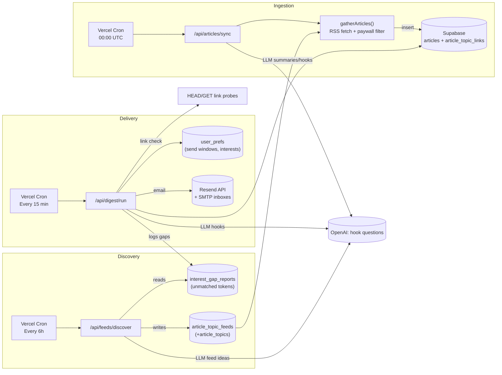

# Automation & Cron Graph

The project currently relies on three scheduled jobs that loop new content into Supabase, discover feeds for uncovered interests, and deliver digests. The diagram below shows how they interact with each other, external services, and shared tables.

## High-level Flow

> **Renderer note:** GitHub renders the diagram below automatically, but some Markdown viewers ignore `mermaid` blocks. If yours does, use the plain-text graph afterward.



**Plain-text graph (same flow):**

```
[Vercel Cron 00:00 UTC]
   ↓ hits
[/api/articles/sync] → gatherArticles() → Supabase.articles + article_topic_links

[Vercel Cron every 6h]
   ↓ hits
[/api/feeds/discover] → reads interest_gap_reports → LLM feed suggestions
   ↘ writes article_topics + article_topic_feeds → feeds consumed by gatherArticles()

[Vercel Cron every 15 min]
   ↓ hits
[/api/digest/run] → reads user_prefs + articles (+topics)
   → link probes & fallback swap → OpenAI hook questions → Resend email send
   → logs unmatched interests back into interest_gap_reports (feeding discovery)
```

## Job-by-job details

### 1. Digest Runner — `/api/digest/run`
- **Schedule:** Every 15 min via Vercel Cron (`vercel.json`). Can also be triggered manually by hitting the route with `?secret=` and optional `dry=1`/`window` params.
- **Auth:** Requires `DIGEST_RUN_SECRET` (or `CRON_SECRET`) in query/header, or a valid `x-vercel-signature` using `VERCEL_CRON_SECRET`.
- **Inputs:**
  - `user_prefs` (interests, cadence, last send timestamps, timezone + send window).
  - `articles`, `article_topics`, and `article_topic_links` (candidate pool of up to 80 newest items).
  - `interest_gap_reports` is appended when no article satisfies an interest token.
- **Processing highlights:**
  - Filters users inside the cron window, enforces timeline cadence, and dedupes articles already sent.
  - Scores articles per interest token (token synonyms + tag/title hits). Requires at least `KEYWORD_THRESHOLD` points, ensuring we only send strongly relevant pieces.
  - Generates hook questions lazily through OpenAI (`gpt-4o-mini`) and persists them back into `articles.hook_question`.
  - Runs a HEAD/GET probe (4.5s timeout, cached per run) on every outbound URL and swaps in a fallback article if a link 404s/500s or times out.
  - Builds email HTML, signs survey links, and sends via Resend (unless `dry=1`).
- **Outputs & side-effects:**
  - Emails per user (or skipped status recorded in API response).
  - Updates `user_prefs.last_digest_sent_at` + `last_digest_article_ids`.
  - Appends unmatched tokens to `interest_gap_reports` (input queue for feed discovery).
  - Logs to Vercel if a send fails (Resend/network issues).

### 2. Article Sync — `/api/articles/sync`
- **Schedule:** Daily at 00:00 UTC via Vercel Cron. You can also hit it manually with optional flags:
  - `dry=1` (no writes), `limit`, `feed=<url>` (repeatable), `noDefault=1`, `source=<sample json>` for local fixtures.
- **Auth:** Requires `ARTICLES_SYNC_SECRET` (falls back to `CRON_SECRET`) or a valid Vercel signature.
- **Processing pipeline:**
  - `gatherArticles()` pulls RSS/Atom feeds (defaults + per-topic feeds from `article_topic_feeds`).
  - Drops items that trip paywall heuristics (domain denylist, “premium” hints, etc.) or duplicates.
  - Uses OpenAI for summaries + hook questions during ingestion, normalizes tags, and maps feeds to `article_topics` via `article_topic_feeds`.
  - `ingestArticles()` upserts into Supabase (`articles`, `article_topic_links`, `article_sources`).
- **Outputs:** Fresh rows in `articles` (and linking tables) that the digest route will consider in its pool.
- **Dependencies:** Needs Supabase service-role key, `OPENAI_API_KEY`, and the feed inventory curated by the discovery pipeline; also reads fallback JSON from `scripts/data/example-articles.json` when feeds are empty.

### 3. Feed Discovery — `/api/feeds/discover`
- **Schedule:** Every 6 hours at hh:15 via Vercel Cron. Also callable manually with: `?slug=biology&dry=1`, `topics`, `feeds`, `hours` (lookback window), `queue=0/1` (disable gap queue).
- **Auth:** Dedicated `FEED_DISCOVERY_SECRET` (falls back to `DIGEST_RUN_SECRET`/`CRON_SECRET`) or Vercel signature.
- **Processing steps:**
  - Pulls explicit `slug` query params plus the top unmatched interests from `interest_gap_reports` (lookback configurable).
  - For each slug, hits OpenAI (`gpt-4o-mini` by default) with a structured prompt that asks for RSS/Atom feeds in JSON.
  - Validates each feed via `fetch` + XML parsing (must return ≥3 entries, HTTP 2xx/3xx) before insertion.
  - Upserts missing topics in `article_topics`, and inserts feeds into `article_topic_feeds` with `metadata.auto_discovered=true`.
  - On success, deletes corresponding rows in `interest_gap_reports` so we stop reprocessing solved gaps.
- **Outputs:** More rows in `article_topic_feeds` (and sometimes `article_topics`), which the nightly article-sync job will pick up automatically.

## Dependency Cheat Sheet

| Component | Reads | Writes | Notes |
|-----------|-------|--------|-------|
| `/api/articles/sync` | Remote RSS, `article_topic_feeds`, sample JSON | `articles`, `article_topic_links`, `article_sources` | Uses OpenAI for summaries/hooks, enforces paywall heuristics. |
| `/api/digest/run` | `user_prefs`, `articles`, `article_topics`, `article_topic_links`, `interest_gap_reports` | Emails (Resend), `user_prefs` (timestamps + article IDs), `interest_gap_reports` | Performs link-health probing & fallback substitution per interest. |
| `/api/feeds/discover` | `interest_gap_reports` | `article_topics`, `article_topic_feeds`, `interest_gap_reports` (cleanup) | Shared logic with `scripts/discover-feeds.mjs`; can be dry-run for diagnostics. |

## Operational Tips
- Keep `DIGEST_RUN_SECRET`, `ARTICLES_SYNC_SECRET`, and `FEED_DISCOVERY_SECRET` distinct so you can rotate access independently; all three also honor `VERCEL_CRON_SECRET` signatures.
- If you need to “unstick” a new interest quickly, run feed discovery manually (`dry=1` first, then live). Once feeds exist, rerun the article sync (`dry=1` to preview) before forcing a digest send.
- Monitor `interest_gap_reports`: a rising count for a slug means discovery hasn’t found viable RSS yet, or the article sync job hasn’t collected from new feeds.
- Link-health issues will now automatically swap in fallback stories, but you can update `FALLBACK_LIBRARY` in `src/app/api/digest/run/route.ts` to keep those backups fresh.
